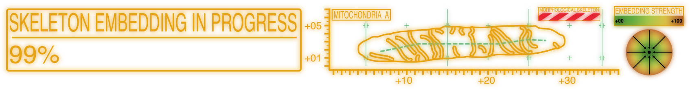

# SKOOTS

 
SKeletOn ObjecT Segmentation - 2D/3D instance segmentation of arbitrary biomedical images.

Currently, in development! Things may change!

Makes use of BISM (Biomedical Image Segmentation Models) and a lot of pyTorch

## 

<!-- start installation -->
To install, make sure pyTorch is installed with CUDA support.

```bash
pip install skoots
```

<!-- end installation -->

## Usage

 
test

## Considerations

 
test

## Warnings

 
test


