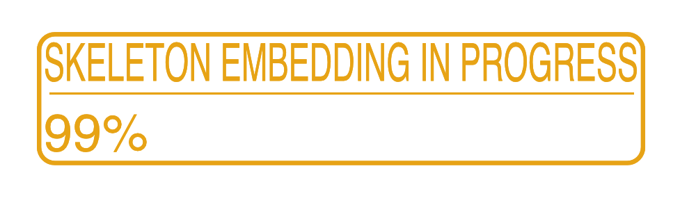

# skoots
SKeletOn ObjecT Segmentation - 2D/3D instance segmentation of arbitrary biomedical images.

Currently, in development! Things may change! 

Makes use of BISM (Biomedical Image Segmentation Models) and a lot of pyTorch
